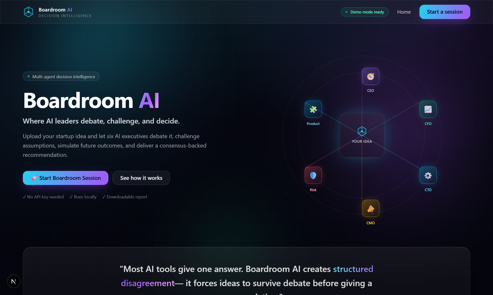
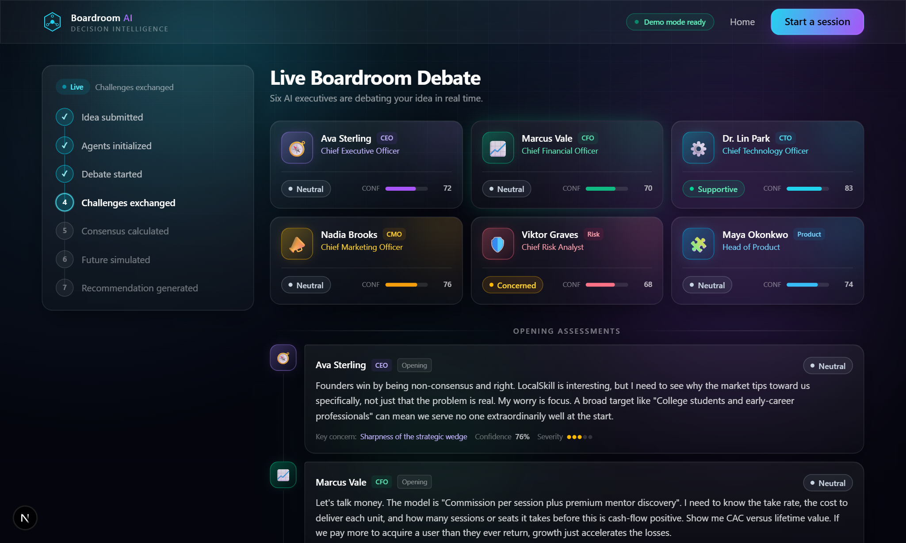
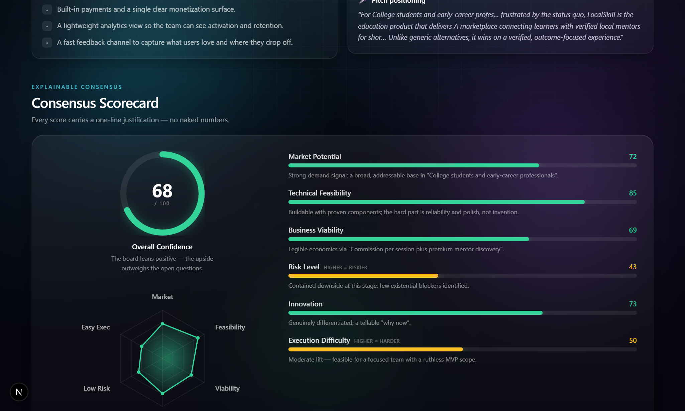

<div align="center">

# 🏛️ Boardroom AI

### _Where AI leaders debate, challenge, and decide._

**An AI executive council that evaluates startup ideas through structured multi-agent debate — then delivers a consensus-backed recommendation.**

[Quick Start](#-quick-start) · [How it works](#-how-it-works) · [API](#-api-reference) · [Demo Script](DEMO_SCRIPT.md)

</div>

---



## ✨ What is this?

Most AI tools give you **one confident answer**. Boardroom AI creates **structured disagreement**.

You submit a startup idea, and six specialized AI executives — **CEO, CFO, CTO, CMO, Risk Analyst, and Head of Product** — debate it live from their own perspectives. They give opening assessments, **challenge each other's weakest assumptions**, defend or revise their positions, and arrive at a final stance. The system then computes an **explainable consensus score**, simulates **three possible futures**, and issues a single **boardroom verdict** with an action plan you can download.

> It forces your idea to survive a debate before giving a recommendation.

| Live multi-agent debate | Explainable consensus |
| --- | --- |
|  |  |

---

## 🎯 The problem

Founders, students, and product teams make high-stakes decisions on thin evidence. The tools available to them are:

- **Single-shot LLM chats** — one smooth, agreeable answer with no adversarial pressure, no scoring, and no accountability for being wrong.
- **Expensive advisors / accelerators** — slow, gated, and not available at 2am when you're sketching an idea.

There's no fast, structured, _opinionated_ way to pressure-test an idea from multiple expert lenses at once.

## 💡 The solution

Boardroom AI is a **decision-intelligence platform**, not a chatbot. It turns one idea into:

1. A **live, four-phase debate** between six role-specialized agents who genuinely disagree.
2. **Seven explainable scores** (market, feasibility, viability, risk, innovation, difficulty, confidence) — each with a one-line justification.
3. **Three future simulations** (optimistic / realistic / pessimistic) with probabilities and drivers.
4. A **final verdict** — `Build` · `Validate First` · `Pivot` · `Drop` — plus action items, experiments, an MVP feature list, and pitch positioning.
5. A **downloadable Markdown / PDF report**.

It runs **fully in demo mode with no API key**, and upgrades to a real LLM if you provide one.

---

## 🌟 Key features

- 🗣️ **Live multi-agent debate** — six executives debate in real time over Server-Sent Events, with a client-side reveal fallback for total reliability.
- ⚔️ **Agents challenge each other** — a deterministic challenge ring guarantees every agent both challenges and is challenged.
- 📊 **Explainable consensus scoring** — no naked numbers; every score ships with a justification.
- 🔮 **Future simulation engine** — three trajectories with probabilities that flex with confidence and risk.
- 🏛️ **Final boardroom verdict** — one decision, fully reasoned, with a concrete next-step plan.
- 📄 **Downloadable report** — copy Markdown, download `.md`, or print to PDF.
- 🎨 **Premium futuristic UI** — dark holographic theme, glassmorphism, neon accents, smooth Framer Motion animations, custom SVG radar/score charts.
- ⚡ **Demo mode that just works** — deterministic, idea-aware mock engine. Zero API keys, zero paid services.

---

## 🧠 How it works

```
                     ┌──────────────────────────────────────────────────────┐
   Startup Idea ───► │                  BOARDROOM PIPELINE                   │
                     │                                                       │
                     │  analyzeIdea()  →  deterministic IdeaSignals          │
                     │        │                                              │
                     │        ▼                                              │
                     │  ┌──────────────┐   opening → challenge →             │
                     │  │ debateEngine │   defense → closing                 │
                     │  └──────┬───────┘   (6 agents × 4 phases = 24 msgs)    │
                     │         │                                             │
                     │         ▼                                             │
                     │  ┌────────────────┐   7 scores + justifications       │
                     │  │ consensusEngine│   + strengths/risks/assumptions   │
                     │  └──────┬─────────┘                                   │
                     │         ▼                                             │
                     │  ┌─────────────────────┐  optimistic / realistic /   │
                     │  │ futureSimulation     │  pessimistic + probability  │
                     │  └──────┬──────────────┘                             │
                     │         ▼                                             │
                     │  ┌─────────────────────┐  Build / Validate / Pivot / │
                     │  │ recommendationEngine │  Drop + action plan         │
                     │  └──────┬──────────────┘                             │
                     │         ▼                                             │
                     │   BoardroomReport ──► UI + Markdown export            │
                     └──────────────────────────────────────────────────────┘
```

The **seven progress stages** shown in the UI: `Idea submitted → Agents initialized → Debate started → Challenges exchanged → Consensus calculated → Future simulated → Recommendation generated`.

---

## 🏗️ Architecture

Boardroom AI is a **single, unified full-stack Next.js application** — the most reliable shape for a one-command local demo. The "backend" is implemented as **Next.js Route Handlers** (`src/app/api/**`) backed by clean, framework-agnostic service modules in `src/lib/**`. The "frontend" is the App Router pages + components.

```
┌───────────────────────────── Browser (Client) ─────────────────────────────┐
│  Landing → Idea form → Live Boardroom (SSE) → Report (charts + export)       │
└───────────────┬──────────────────────────────────────────────┬─────────────┘
                │ fetch / EventSource                            │
┌───────────────▼─────────── Next.js Route Handlers ────────────▼─────────────┐
│  POST /api/session   GET /api/session/[id]   POST .../debate                 │
│  GET  .../stream(SSE)  GET .../report  POST .../export   GET /api/health      │
└───────────────┬─────────────────────────────────────────────────────────────┘
                │ calls
┌───────────────▼──────────────── src/lib (server) ───────────────────────────┐
│  agents/  ·  engines/{debate,consensus,futureSimulation,recommendation}      │
│  services/{llmProvider, mockProvider, reportService, sessionStore}           │
│  analysis.ts  ·  markdown.ts  ·  types.ts                                     │
└──────────────────────────────────────────────────────────────────────────────┘
```

> **Why one app instead of separate FastAPI + frontend?** Priority #1 is a working end-to-end demo. A unified Next.js app means **one `npm install`, one `npm run dev`** — no two-server orchestration, no CORS, no Python toolchain. The backend logic is still cleanly separated into modular services, so it could be lifted into a standalone API with minimal changes.

### 📁 Folder structure

```
boardroom-ai/
├─ src/
│  ├─ app/                       # App Router pages + API routes
│  │  ├─ page.tsx                # Landing
│  │  ├─ idea/page.tsx           # Idea intake (validated form + samples)
│  │  ├─ boardroom/[id]/page.tsx # Live debate (SSE)
│  │  ├─ report/[id]/page.tsx    # Final report
│  │  ├─ error.tsx · not-found.tsx
│  │  └─ api/
│  │     ├─ health/route.ts
│  │     └─ session/route.ts + [id]/{route,debate,stream,report,export}/route.ts
│  ├─ components/                # AgentCard, DebateTimeline, ScoreDashboard,
│  │                             # RadarChart, SimulationTimeline, FinalRecommendation,
│  │                             # ReportView, HeroBoard, ProgressSteps, …
│  └─ lib/
│     ├─ types.ts                # All data models
│     ├─ analysis.ts             # Deterministic idea → signals + seeded RNG
│     ├─ samples.ts              # Sample startup ideas
│     ├─ validation.ts           # Shared idea validation
│     ├─ markdown.ts             # Pure report → Markdown serializer
│     ├─ agents/                 # The six agent personas
│     ├─ engines/                # debate · consensus · futureSimulation · recommendation
│     ├─ services/               # llmProvider · mockProvider · reportService · sessionStore
│     └─ client/                 # api.ts (fetch helpers) · theme.ts (accent tokens)
├─ docs/screenshots/
├─ .env.example
├─ DEMO_SCRIPT.md · CONTRIBUTING.md · README.md
```

### 🧰 Tech stack

| Layer | Choice |
| --- | --- |
| Framework | **Next.js 16** (App Router, React 19, TypeScript) |
| Styling | **Tailwind CSS v4** — dark theme, glassmorphism, neon |
| Animation | **Framer Motion** |
| Charts | **Hand-built animated SVG** (radar, gauges, bars) — zero chart dependency |
| Backend | **Next.js Route Handlers** + in-memory session store |
| Streaming | **Server-Sent Events** (with client-reveal fallback) |
| AI | OpenAI-compatible provider abstraction + deterministic mock provider |

---

## 🚀 Quick start

> **Prerequisites:** Node.js **20.9+** (works great on 24) and npm.

```bash
# 1. Install dependencies
npm install

# 2. Run the dev server (demo mode — no API key needed)
npm run dev

# 3. Open the app
#    http://localhost:3000
```

That's it. Click **Start Boardroom Session**, load the **LocalSkill** sample, and watch the board debate.

### Production build

```bash
npm run build
npm run start
```

### Lint

```bash
npm run lint
```

---

## 🔐 Environment variables

Boardroom AI runs **without any configuration** in demo mode. To use a real LLM, copy `.env.example` to `.env.local` and fill it in:

```bash
cp .env.example .env.local
```

| Variable | Default | Description |
| --- | --- | --- |
| `OPENAI_API_KEY` | _(unset)_ | If present, switches to **LLM mode**. Unset ⇒ demo (mock) mode. |
| `OPENAI_BASE_URL` | `https://api.openai.com/v1` | Any **OpenAI-compatible** endpoint (OpenAI, Azure, Groq, Ollama, LM Studio, …). |
| `OPENAI_MODEL` | `gpt-4o-mini` | Chat model name. |
| `BOARDROOM_FORCE_MOCK` | _(unset)_ | Set to `1` to force demo mode even when a key is present. |

---

## 🎭 Demo mode (how it works without an API key)

The **mock provider** (`src/lib/services/mockProvider.ts`) is the deterministic brain behind demo mode:

1. `analyzeIdea()` converts the idea text into **signals** (market reach, monetization clarity, tech complexity, regulatory risk, competition, novelty, defensibility, stage maturity, specificity).
2. Each agent's **disposition** toward the idea is computed from the signals relevant to their lens.
3. Disposition drives the agent's **stance, confidence, score impact, and severity**; idea-aware phrase banks render the message text in each agent's distinct voice.
4. The same idea always produces the **same debate and scores** (seeded RNG) — reproducible demos, explainable numbers.

When `OPENAI_API_KEY` is set, the deterministic structure stays, but each message's **prose is enriched by the real model** (with a safe fallback to the deterministic text if any call fails).

---

## 📡 API reference

All endpoints are JSON unless noted. Base URL: `http://localhost:3000`.

| Method | Endpoint | Description |
| --- | --- | --- |
| `POST` | `/api/session` | Create a session from an idea. Body: `{ "idea": StartupIdea }`. Returns `{ sessionId, mode }`. |
| `GET` | `/api/session/[id]` | Fetch a session (includes the report once generated). |
| `POST` | `/api/session/[id]/debate` | Run the full pipeline. Returns `{ report }`. Idempotent (cached); `?force=1` to rerun. |
| `GET` | `/api/session/[id]/stream` | **SSE** live debate. Events: `status`, `agents`, `message`, `report`, `done`. `?pace=ms`. |
| `GET` | `/api/session/[id]/report` | Report JSON, or `?format=markdown` for Markdown. |
| `POST` | `/api/session/[id]/export` | Export Markdown: `{ filename, markdown }`, or `?download=1` for a file. |
| `GET` | `/api/health` | Liveness + current mode. |

<details>
<summary><b>Example: run a full session with cURL</b></summary>

```bash
# Create
SID=$(curl -s localhost:3000/api/session -H 'content-type: application/json' \
  -d '{"idea":{"title":"LocalSkill","problem":"Students cannot find trusted local mentors for practical skills.","targetUsers":"College students","solution":"A marketplace for verified local mentors and short outcome-based sessions.","businessModel":"Commission per session + premium discovery","stage":"Idea stage"}}' \
  | python -c "import sys,json;print(json.load(sys.stdin)['sessionId'])")

# Debate + report
curl -s -X POST localhost:3000/api/session/$SID/debate | python -m json.tool

# Markdown report
curl -s "localhost:3000/api/session/$SID/report?format=markdown"
```
</details>

See [`src/app/api/README.md`](src/app/api/README.md) for the full backend reference.

---

## 👔 The agents

| Agent | Role | Decision lens | Personality |
| --- | --- | --- | --- |
| **Ava Sterling** 🧭 | CEO | Vision, market positioning, defensibility | Big-picture, strategic, decisive |
| **Marcus Vale** 📈 | CFO | Unit economics, funding risk, profitability | Skeptical, metrics-driven |
| **Dr. Lin Park** ⚙️ | CTO | Feasibility, architecture, scalability | Pragmatic builder |
| **Nadia Brooks** 📣 | CMO | Go-to-market, acquisition, brand | Growth-obsessed |
| **Viktor Graves** 🛡️ | Risk | Legal, ethical, operational blind spots | Adversarial, cautious |
| **Maya Okonkwo** 🧩 | Product | Product-market fit, UX, roadmap | User-first |

**Challenge ring:** `CEO → Risk → CTO → Product → CMO → CFO → CEO`. Every agent challenges exactly one peer and is challenged by exactly one — guaranteeing real cross-examination, not parallel monologues.

## 📊 The consensus engine

Each score is `signal-derived baseline + damped aggregate debate impact`, clamped to 0–100:

- **Baseline** comes from the idea signals (e.g. feasibility starts high and drops with technical complexity & regulatory load).
- **Debate impact** is the sum of every agent's `scoreImpact` across the debate, scaled so the board can meaningfully move — but not dominate — the baseline.
- **Overall confidence** is a weighted blend of all dimensions (risk & difficulty inverted), nudged by the board's mean disposition.
- Every score is paired with a **tier-aware justification** referencing the idea, so the number is never naked.

It's **deterministic** — perfect for reproducible demos and judge scrutiny.

## 🔮 The future simulation engine

Three scenarios are generated with **probabilities that flex with the consensus** (higher confidence pushes probability toward optimistic; higher risk pushes toward pessimistic). The three always sum to 100%. Each scenario includes a 6-month and 12-month outlook, success & failure drivers tailored to the idea's signals, and strategic advice.

---

## 📥 Example input / 📤 example output

**Input** (the built-in `LocalSkill` sample):

```
Title:    LocalSkill
Problem:  Students and early professionals struggle to find trusted local
          mentors for practical skills like public speaking and interview prep.
Users:    College students and early-career professionals
Solution: A marketplace connecting learners with verified local mentors for
          short, outcome-based sessions.
Model:    Commission per session plus premium mentor discovery
Stage:    Idea stage
```

**Output** (abridged):

```
Verdict:  BUILD — "Greenlight LocalSkill: the thesis is strong enough to build, with focus."
Scores:   Market 72 · Feasibility 85 · Viability 69 · Risk 43 · Innovation 73 · Difficulty 50 · Confidence 68
Futures:  Optimistic 34% · Realistic 53% · Pessimistic 13%
Plan:     5 action items · 3 validation experiments · 6 MVP features · pitch positioning
```

A full Markdown report is downloadable from the report page (or via the export endpoint).

---

## 🗺️ Future improvements

- **Persistent storage** (Redis / Postgres) to survive restarts and scale beyond one instance.
- **True token-streaming** of agent prose when in LLM mode (per-token SSE).
- **Idea comparison** — run several ideas and rank them on one dashboard.
- **PDF export** via a server-side renderer (currently print-to-PDF).
- **User accounts & history** of past boardroom sessions.
- **Configurable boards** — add/remove agents or tune their risk appetite.
- **Voice mode** — narrate the debate aloud for live presentations.

---

## 👥 Team

> _Replace with your team details before submitting._

| Name | Role |
| --- | --- |
| _Your Name_ | Full-stack / AI |
| _Teammate_ | Design / Frontend |
| _Teammate_ | Product / Pitch |

---

## 📄 License

MIT — see [LICENSE](LICENSE). Built for a hackathon; use it, fork it, ship it.

<div align="center">

**Boardroom AI** · _Most AI tools give one answer. We make ideas survive debate._

</div>
